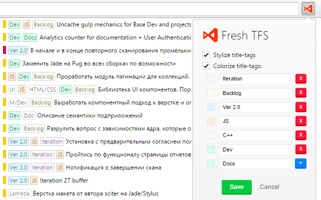

#  Fresh TFS [![Version] [version-img]][url] [![Rating] [rating-img]][url] [![Downloads] [downloads-img]][url]
Let's make TFS great ~~again~~!

[version-img]: https://img.shields.io/chrome-web-store/v/nfefmjlaaohglofpdnhgeccegigjcalf.svg?label=version&colorB=44cc11
[downloads-img]: https://img.shields.io/chrome-web-store/d/nfefmjlaaohglofpdnhgeccegigjcalf.svg?colorB=44cc11
[rating-img]: https://img.shields.io/chrome-web-store/rating/nfefmjlaaohglofpdnhgeccegigjcalf.svg
[url]: https://chrome.google.com/webstore/detail/kinotracker/nfefmjlaaohglofpdnhgeccegigjcalf

Chrome Extension for TFS tags highlighting

| 

    

